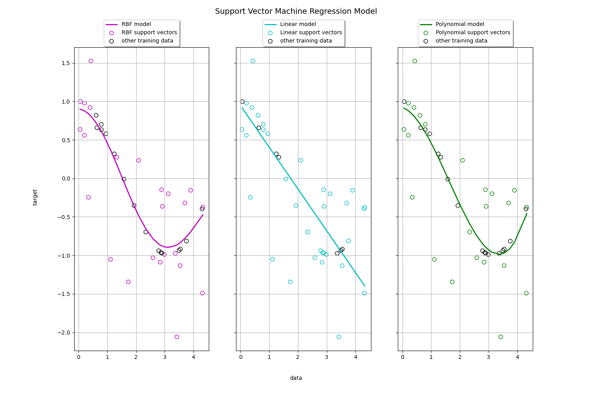

Machine Learning #02 Deliverable: Support Vector Machines (SVM)
==================================================================================

*Background about the dataset:* 
The Iris dataset consists of 150 samples of three types of different Iris flowers (50 samples per type), these types are *["setosa", "versicolour", "virginica"]*. Each sample has four input features, these are *["petal length", "petal width", "sepal length", "sepal width"]* all in cm are different measurements of the flower parts.

*Background about Support Vector Machines*
Support Vector Machines are a Supervised Learning algorithm that makes use of hyperplanes to separate classes or perform regression task. The easiest way to ilustrate it is a binary classification scenario where we have a distribution of samples in an n-dimensional space. A reasonable choice is to define the hyperplane as the one that represents the largest separation or margin between the two classes. The SVM algorithm chooses the hyperplane so that the distance from it to the nearest datapoint on each side is maximized. 

More formally, a support vector machine constructs a hyperplane or set of hyperplanes in a high or infinite-dimensional space, which can be used for classification, regression, or other tasks like outliers detection. Intuitively, a good separation is achieved by the hyperplane that has the largest distance to the nearest training-data point of any class (so-called functional margin), since in general the larger the margin, the lower the generalization error of the classifier. A lower generalization error means that the implementer is less likely to experience overfitting.

In addition to performing linear classification, SVMs can perform efficiently non-linear classification using the kernel trick.

In order to illustrate the workings of Support Vector Machines, I attached three python scripts with this deliverable. I used the Iris dataset for all of them, the files are:
1. *01_svc_example.py* which deploys a Support Vector Classifier (SVC) on Pytorch, performing a binary classification task of setosa samples vs others. It outputs the accuracy on a test set of the designed model.
2. *02_svc_kernels.py* uses in-built SVC model from *sklearn* Python library. The purpose of this file is to illustrate the effect of different input variables, classification targets and kernels on the SVC model's performance. 
3. *03_svr_kernels.py* uses in-built SVR model from *sklearn* Python library. The purpose of this file is to illustrate the regression equation computation using different kernels.


## *01_svc_example.py*
----------------------------------------------------------

There are two preprocessing steps on the data:
1. Scaling the features by standarization (centering on `mean=0` and `std=1`)
2. Set all targets != 0 to 1 so we turn the iris dataset original three-classes into two.

A brief description of the model design in Pytorch, a single linear layer, which takes 4 input features and outputs a single prediction (setosa or others).
```python
class SVM(nn.Module):
    def __init__(self, input_dim):
        super(SVM, self).__init__()
        self.fc = nn.Linear(input_dim, 1)

    def forward(self, x):
        return self.fc(x)
```

The loss function used is [HingeEmbeddingLoss](https://en.wikipedia.org/wiki/Hinge_loss), on a high level, it measures how far (margin) is the prediction made from the ground truth value for each sample in the train set and averages all these margins. Since the target is binary (setosa vs others), the optimal margin values will be 0 or 1 depending on the class. The function is defined in the next code snippet:
```python
def hinge_loss(outputs, targets):
    margin = 1 - targets * outputs
    loss = torch.mean(torch.clamp(margin, min=0))
    return loss
```

To run this script just refer to below snippet:
```bash
python 01_svc_example.py
``` 

An output example:
```bash
Using cuda device
epoch: [10/500], loss: 0.5341
epoch: [20/500], loss: 0.5124
....
....
epoch: [490/500], loss: 0.3436
epoch: [500/500], loss: 0.3435
Accuracy: 0.7333
              precision    recall  f1-score   support

      Setosa       1.00      1.00      1.00         9
       Other       0.62      1.00      0.76        13

   micro avg       0.73      1.00      0.85        22
   macro avg       0.81      1.00      0.88        22
weighted avg       0.77      1.00      0.86        22
```


## *02_svc_kernels.py*
----------------------------------------

This code will illustrate the decision boundaries computed by the SVC model using four different kernel functions: 'linear', 'polynomial', 'rbf' (radial basis function) and 'sigmoid'.

After execution it will return two figures:
    - Figure 1: input training samples with ground truth classes.
    - Figure 2: decision boundaries plotted for all four kernels.
    - Additionally, accuracy of the models on the test dataset is returned.


### Step 0: Preparing the datset

I used again the Iris dataset, however, this time I only considered the last two input variables (*petal length* and *petal width*) and built a binary classifier of *'setosa'* iris flower versus the rest. This was done for plot simplicity.

```Python
# 0) prepare the iris dataset
bc = load_iris()
X, y = bc.data, bc.target

y = y.reshape((len(y),1))

# For this demonstration, I will just run SVM on the petal length and width (the last two features), 
# and build a setosa vs the rest classifier. Constructing the training data:
X = [[x[2], x[3]] for x in X]

X = np.asanyarray(X, dtype=np.float32)

for i in range(len(y)):
    if y[i] == 0: y[i] = 1
    else: y[i] = -1

y = np.asarray(y, dtype=np.float32)
```


### Step 1: Defining the SVC models 

As mentioned earlier, for simplicity, this was done with *sklearn.dataset* in-built model. I also defined some variables for later use in the plot.

```Python
# define the models with different kernels
svc_rbf = SVC(kernel="rbf", gamma=2)
svc_lin = SVC(kernel="linear", gamma=2)
svc_poly = SVC(kernel="poly", gamma=2)
svc_sigm = SVC(kernel="sigmoid", gamma=2)

svcs = [svc_lin, svc_poly, svc_rbf, svc_sigm]
kernel_label = ["Linear", "Polynomial", "RBF", "Sigmoid"]
model_color = ["m", "c", "g", "r"]
lw = 2
```

### Step 2: Training the SVC models

Since these is an SVC in-built model, it is not necessary to define any loss function, optimizer nor a training loop. Only by calling model's method *.fit()* the model is trained according to the data passed.

```Python
clf = model.fit(X_train,y_train.ravel())
```


### Step 3: Plots

The plotting function is completely based on the example code in [sklearn website](https://scikit-learn.org/stable/auto_examples/svm/plot_svm_kernels.html). I only merged all plots in one figure for easier visualisation. Please observe in below figure the obtained results on the different models:


It is clear from the first plot that setosa iris flower has shorter and thinner petals than the other two varieties. This is simple for the model to detect and the models trained with all three kernels do a perfect job classifying the different input samples. This can be seen on the accuracy computed for the test dataset on each model.

```terminal
model's accuracy with linear kernel: 1.000
model's accuracy with poly kernel: 1.000
model's accuracy with rbf kernel: 1.000
model's accuracy with sigmoid kernel: 0.700
```


However, it is interesting to see what happens if I change the binary classification problem. For instance, below figure illustrate the model's classification boundaries behaviour with different kernels but this time for a 'virginica' vs the rest classifier (again with petal length and width as input variables).


The features (petal length and width) for the virginica flower are not clearly separated from the other two spieces now as it can be appreciated on the first figure. On the second figure, it becomes clear how using different kernels affects the classification performance of the model.

```terminal
model's accuracy with linear kernel: 1.000
model's accuracy with poly kernel: 0.967
model's accuracy with rbf kernel: 1.000
model's accuracy with sigmoid kernel: 0.733
```


Lastly, I also made a third execution changing the input variables to sepal length and width, this time classifying 'versicolour' versus the rest. 


The polynomial kernel performs the best classifying versicolour iris flowers using the sepal width and length.

```terminal
model's accuracy with linear kernel: 0.533
model's accuracy with poly kernel: 0.867
model's accuracy with rbf kernel: 0.800
model's accuracy with sigmoid kernel: 0.567
```

### Conclusion: 

These experiments showcase how input data, classification targets and kernels can affect the performance of a Support Vector Machine Classifier model.


## *03_svr_kernels.py*
------------------------------------------------

This script is based on sklearn API example for [plotting SVM regression](https://scikit-learn.org/stable/auto_examples/svm/plot_svm_regression.html). It aims to showcase how regression lines are computed by the SVR models using three different kernel functions: 'linear', 'polynomial' and 'rbf' (radial basis function).

The code will return a figure with the input samples and the computed regression lines.


### Step 0: Preparing the dataset

To best illustrate the power of kernels in computing regression lines, I decided to express output samples as a cosine function of the input samples.

I also introduced noise on some of the output samples.

```Python
# 0) dataset generation
X = np.sort(5 * np.random.rand(40, 1), axis=0)
y = np.cos(X).ravel()

# one every two samples add some noise to targets
y[::2] += 3 * (0.5 - np.random.rand(20))

X = np.asarray(X, dtype= np.float32)
y = np.asarray(y, dtype= np.float32)
```


### Step 1: Defining the SVR models

Using *sklearn.datasets* in-built SVR model, I create three different SVR models that use 'rbf', 'linear' and 'polynomial' kernels respectively. Some lists are also defined for plotting the predicted regression lines of each model.

```Python
# define the models with different kernels
svr_rbf = SVR(kernel="rbf", C=100, gamma=0.1, epsilon=0.1)
svr_lin = SVR(kernel="linear", C=100, gamma="auto")
svr_poly = SVR(kernel="poly", C=100, gamma="auto", degree=3, epsilon=0.1, coef0=1)

lw = 2

svrs = [svr_rbf, svr_lin, svr_poly]
kernel_label = ["RBF", "Linear", "Polynomial"]
model_color = ["m", "c", "g"]
```


### Step 2: Plots

The output figure consists of three plots, one for each SVR model ('RBF', 'Linear' and 'Polynomial'). The predicted regression line is plotted in solid color as the samples that serve as support vectors for the line. The rest of the training samples, which are not used to compute the Support Vector Machine regression line are plotted in black.



Since the model is based on a cosine function, it establishes a clear non-linear relation between the input and output samples. Thus the best performing models to compute the regression line are the ones that use 'RBF' and 'Polynomial' kernels.