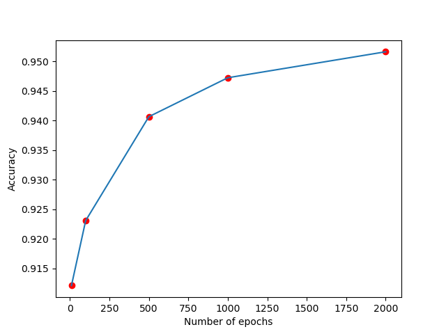

# Logistic Regression with NumPy

This project demonstrates the implementation of Logistic Regression using NumPy. The script trains a Logistic Regression model on the Breast Cancer dataset from Scikit-learn and visualizes the relationship between the number of training epochs and the training accuracy.

## What is Logistic Regression?
Logistic Regression is a supervised learning algorithm used for binary classification tasks. Unlike linear regression, which predicts continuous outputs, logistic regression predicts discrete outcomes (0 or 1). It uses the sigmoid function to map any real-valued number into a range between 0 and 1. The core idea is:

\[
\sigma(x) = \frac{1}{1 + e^{-x}}
\]

### Key Steps:
1. **Model Initialization:** Initialize weights and biases.
2. **Forward Pass:** Compute predictions using the sigmoid function.
3. **Loss Calculation:** Compute the difference between predicted and actual values.
4. **Backward Pass:** Use gradients to adjust weights and biases (gradient descent).
5. **Prediction:** Classify based on a threshold (0.5 by default).

## Script Overview
### Requirements
Ensure the following libraries are installed:
- `numpy`
- `scikit-learn`
- `matplotlib`

### Data Preparation
The script uses the Breast Cancer dataset from Scikit-learn:
- Features are standardized using mean and standard deviation.
- The dataset is split into training and testing sets.

### Logistic Regression Class
The `LogisticRegression` class includes:
- **Initialization:** Set learning rate, iterations, weights, and bias.
- **Fit:** Train the model using gradient descent.
- **Predict:** Make predictions based on learned parameters.

### Main Script Workflow
1. Import and prepare the Breast Cancer dataset.
2. Standardize features to improve convergence during training.
3. Define and train multiple Logistic Regression models for different epoch counts (`10`, `100`, `500`, `1000`, `2000`).
4. Compute and display:
   - Training accuracy.
   - Test accuracy.
5. Plot the relationship between epochs and training accuracy.

### Output
- Training and test accuracy for each epoch count.
- A plot showing the effect of epoch count on training accuracy.

### Functions
- **`accuracy(y_true, y_pred)`**: Computes the classification accuracy.
- **`standardScaler(input_data)`**: Standardizes input data by scaling each feature.

## How to Run the Script
1. Clone or download the repository.
2. Ensure Python 3.x is installed along with the required libraries.
3. Run the script:
   ```bash
   python logistic_regression.py
   ```
4. Observe accuracy metrics printed to the console and the accuracy plot.

## Sample Output
```plaintext
Logistic Regressor Model trained for 10 epochs, training accuracy: 0.9385
Test dataset accuracy: 0.9298

Logistic Regressor Model trained for 100 epochs, training accuracy: 0.9571
Test dataset accuracy: 0.9386

Logistic Regressor Model trained for 500 epochs, training accuracy: 0.9648
Test dataset accuracy: 0.9474

Logistic Regressor Model trained for 1000 epochs, training accuracy: 0.9681
Test dataset accuracy: 0.9561

Logistic Regressor Model trained for 2000 epochs, training accuracy: 0.9692
Test dataset accuracy: 0.9561
```

## Visualization
The script generates a plot illustrating how increasing the number of training epochs improves accuracy on the training dataset.



## Table with the most common Machine Learning activation functions

A Neural Network consists of nodes (neurons) interconnected with each other, this neurons perform operations on the samples and the parameters of these operations are updated while the training loop runs. To the output of these neurons **activation functions** are applied. They introduce *non-linearity* to the model, allowing the network to learn and represent complex patterns in the data. **Without this non-linearity applied, a neural network would behave like a linear regression model, independently of the number of layers it contains**.

| Function Name     | Plot  | Function $f(x)$                                    | Derivative of $f$, $f'(x)$ | Range  |
|-------------------|-------|----------------------------------------------------|-----------------------------|--------|
| Linear function   |       | $x$                                                | $1$                      | $(-\infin,+\infin)$  |
| Sigmoid function  |       | $\sigma(x)=\frac{1}{(1+e^{-x})}$                   | $f(x)(1-f(x))$                        | $(0,1)$              |
| Softmax function  |       | $\sigma_{i}(x)=\frac{e^{x_{i}}}{\sum_{j}e^{x_{j}}}$                       | $\sigma_{i}(x)(\delta_{ij}(x)-\sigma_{j}(x))$          | $(0,1)$              |
| ReLU              |       | $\begin{cases} 0 \text{ if } x < 0 \\ x \text{ if } x \geq 0 \\ \end{cases}$                | $\begin{cases} 0 \text{ if } x < 0 \\ 1 \text{ if } x \geq 0 \\ \end{cases}$  | $[0,\infin)$       |
| tanh              |       | $tanh(x)=\frac{e^{x}-e^{-x}}{e^{x}+e^{-x}}$        | $1-f^{2}(x)$                        | $(-1,1)$         |