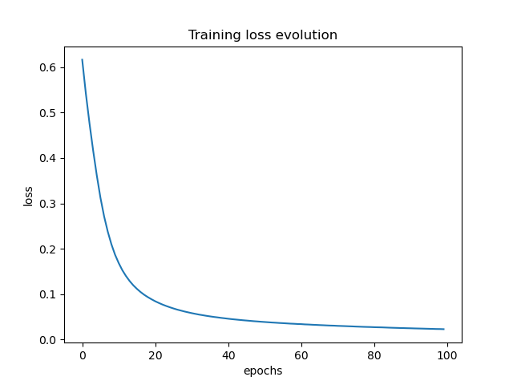
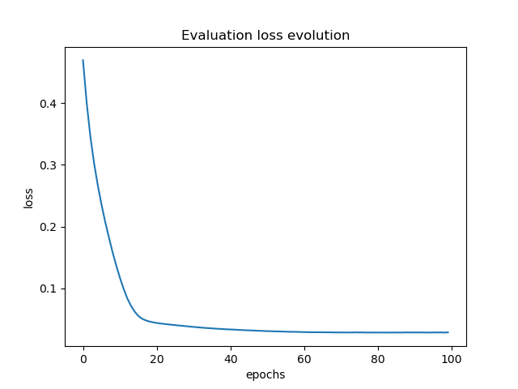

# Neural Network

A Neural Network is a machine learning model that consists of inter-connected nodes called *neurons*, these *neurons* are connected by *edges*. Each neuron receives data from connected neurons, it processes it and sends it to other connected neurons. The data is a real number and the output of each neuron is computed by some non-linear function of the sum of its inputs, known as [activation function](/ASS03-LogisticRegression/). The strength of the data at each connection is determined by a *weight* which is adjusted during the learning process.

The following code builds two neural-network based systems that perform two tasks:
1. Classification Neural Network (`classification_model.py`): To classify data from the [Wisconsin Breast Cancer dataset](10.24432/C5DW2B).
2. Regression Neural Network (`regression_model.py`): To predict sugar levels in blood from the Diabetes dataset from [Efron et al.](http://dx.doi.org/10.1214/009053604000000067).


## 1. Classification Neural Network
The goal of this system is to classify from the input data whether we have a cancerous or benign tumor.

### Overview of the Neural Network
The Neural Network consists of:
- **Input Layer:** 30 features corresponding to the dataset attributes.
- **Hidden Layer:** 15 neurons with ReLU activation function.
- **Output Layer:** 1 neuron with a Sigmoid activation function for binary classification.

The network is trained using batch gradient descent and the Binary Cross Entropy Loss function.

### Dataset
The Wisconsin Breast Cancer dataset is included in Scikit-learn. It contains 569 samples with 30 features each:
- **Features:** Mean, standard error, and worst values of various tumor characteristics.
- **Labels:** 1 for malignant and 0 for benign tumors.

The dataset is preprocessed by scaling features using the StandardScaler to ensure convergence.

### Code Workflow
#### A. Data Preparation
The `BreastCancerDataset` class extends `torch.utils.data.Dataset` to load, preprocess, and manage the dataset. Features are standardized using Scikit-learn's `StandardScaler`. The dataset is then split into training and testing subsets using `train_test_split`.

#### B. Model Architecture
The `BinaryClassification` class defines a simple feedforward neural network:
```python
class BinaryClassification(nn.Module):
    def __init__(self, n_input_features, n_hidden_neurons, n_output_neurons):
        super(BinaryClassification, self).__init__()
        self.linear1 = nn.Linear(n_input_features, n_hidden_neurons)
        self.relu = nn.ReLU()
        self.linear2 = nn.Linear(n_hidden_neurons, n_output_neurons)
        self.sigmoid = nn.Sigmoid()

    def forward(self, x):
        x = self.linear1(x)
        x = self.relu(x)
        x = self.linear2(x)
        x = self.sigmoid(x)
        return x
```

#### C. Training
- **Loss Function:** Binary Cross Entropy Loss (`BCELoss`).
- **Optimizer:** Adam optimizer with a learning rate of 0.001.
- **Epochs:** 100.
- **Batch Size:** 35.

The training loop includes forward passes, loss computation, backpropagation, and parameter updates.

#### D. Testing
The model's accuracy is computed on the test set by comparing predictions with true labels. Predictions are rounded to 0 or 1 for binary classification.

#### E. Visualization
A plot shows the training loss evolution across epochs, providing insights into model convergence.

### Running the Code
#### Prerequisites
- Python 3.9
- PyTorch
- Scikit-learn
- Matplotlib

Install dependencies using pip:
```bash
pip install torch scikit-learn matplotlib
```

#### Execution
Run the script:
```bash
python classification_model.py
```

#### Output
- Training loss for each epoch is printed.
- Test accuracy is displayed at the end of training.
- A plot shows the training loss evolution.

##### Example Output
```plaintext
Using cuda device
Epoch 1/100, step 4/13, loss = 0.6930
Epoch 1/100, step 8/13, loss = 0.6875
...
Epoch 100/100, step 12/13, loss = 0.0113

Test metrics: 
accuracy = 96.4912 %
```

#### Visualization
A graph of the training loss evolution:



### Customization
- Adjust `input_size`, `hidden_neuron_num`, `num_epochs`, or `batch_size` to experiment with different model configurations.
- Use other binary classification datasets to evaluate the model's versatility.


## 2. Regression Neural Network
This system must predict sugar levels in blood samples based on the input data.

### Overview of the Neural Network
The Neural Network architecture is as follows:
- **Input Layer:** 10 features corresponding to patient data.
- **Hidden Layer:** 4 neurons with ReLU activation function.
- **Output Layer:** 1 neuron for predicting a continuous value (blood sugar levels).

The network is trained using batch gradient descent and the Mean Squared Error (MSE) loss function.

### Dataset
The Diabetes dataset is included in Scikit-learn. It contains 442 samples with 10 features each:
- **Features:** Quantitative physiological variables such as age, BMI, and blood pressure.
- **Target:** A quantitative measure of disease progression one year after baseline.

The dataset is preprocessed by scaling both features and target values to the [0,1] range using MinMaxScaler.

### Code Workflow
#### A. Data Preparation
The `DiabetesDataset` class extends `torch.utils.data.Dataset` to load, preprocess, and manage the dataset. Features and targets are normalized to improve model performance. The dataset is split into training and testing subsets using `train_test_split`.

#### B. Model Architecture
The `LinearRegression` class defines a simple feedforward neural network:
```python
class LinearRegression(nn.Module):
    def __init__(self, n_input_features, n_output_neurons, n_hidden_neurons):
        super(LinearRegression, self).__init__()
        self.linear1 = nn.Linear(n_input_features, n_hidden_neurons)
        self.relu = nn.ReLU()
        self.linear2 = nn.Linear(n_hidden_neurons, n_output_neurons)

    def forward(self, x):
        x = self.linear1(x)
        x = self.relu(x)
        x = self.linear2(x)
        return x
```
#### C. Training
- **Loss Function:** Mean Squared Error Loss (`MSELoss`).
- **Optimizer:** Adam optimizer with a learning rate of 0.001.
- **Epochs:** 100.
- **Batch Size:** 10.

The training loop involves forward passes, loss computation, backpropagation, and parameter updates. At the end of each epoch, the model is evaluated on the test set to track performance and identify the best model based on MSE.

#### D. Testing
The model is tested using the Mean Squared Error (MSE) and Root Mean Squared Error (RMSE) metrics. The best model weights are restored after training.

#### E. Visualization
A plot shows the evaluation loss (MSE) evolution across epochs, providing insights into model convergence.

### Running the Code
#### Prerequisites
- Python 3.9
- PyTorch
- Scikit-learn
- Matplotlib

Install dependencies using pip:
```bash
pip install torch scikit-learn matplotlib
```

#### Execution
Run the script:
```bash
python regression_model.py
```

#### Output
- Training loss for each epoch is printed.
- Best evaluation metrics (MSE and RMSE) are displayed.
- A plot shows the evaluation loss evolution.

##### Example Output
```plaintext
Using cuda device
Epoch 1/100, step 6/36, loss = 0.0721
Epoch 1/100, step 12/36, loss = 0.0643
...
Epoch 100/100, step 36/36, loss = 0.0023

Evaluation metrics: 
	MSE: 0.0021
	RMSE: 0.0458
```

#### Visualization
A graph of the evaluation loss evolution:



### Customization
- Adjust `input_size`, `hidden_neuron_num`, `num_epochs`, or `batch_size` to experiment with different model configurations.
- Use other regression datasets to evaluate the model's flexibility.
