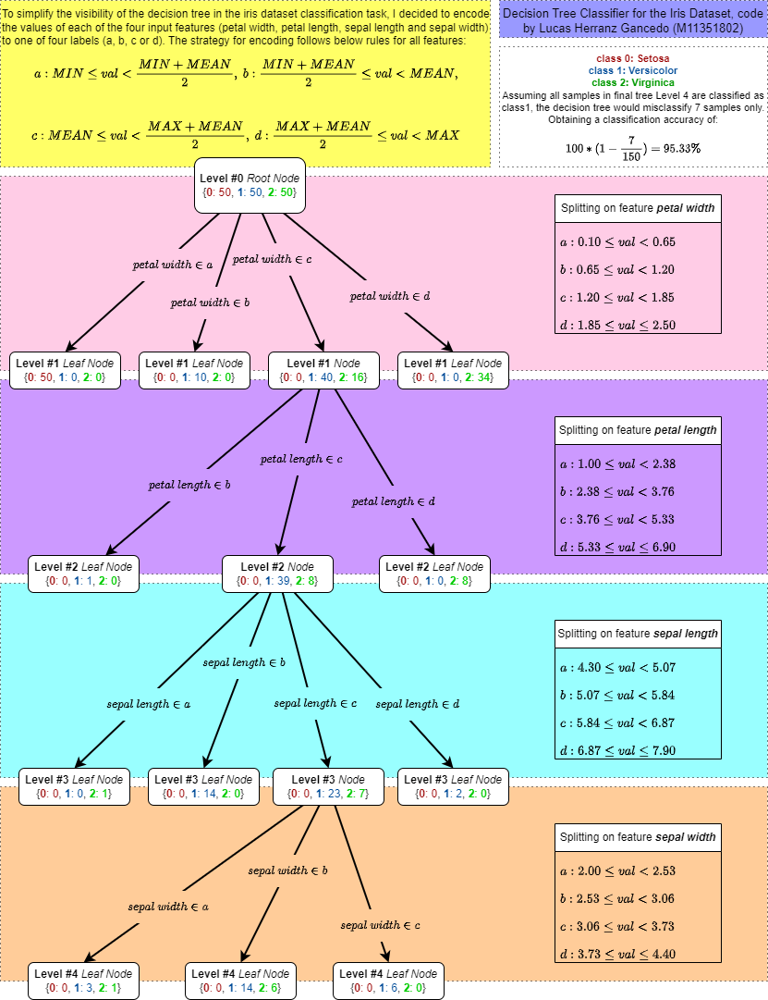

# Introduction to Decision Trees and K-Means Clustering

This document provides an overview of two essential machine learning algorithms: **Decision Trees** for supervised learning and **K-Means Clustering** for unsupervised learning. Both algorithms are widely used in various applications due to their simplicity, interpretability, and effectiveness.

## Decision Trees (`dt_classifier.py`)
### Overview
Decision Trees are a supervised learning algorithm used for both classification and regression tasks. They split the dataset into smaller subsets based on feature values, creating a tree-like structure where each node represents a decision point.

### Key Concepts
1. **Root Node:** The topmost node of the tree, representing the initial decision based on a feature.
2. **Leaf Nodes:** The terminal nodes of the tree, representing the final output or prediction.
3. **Splitting:** The process of dividing the dataset based on feature thresholds to maximize homogeneity within subsets.
4. **Impurity Measures:** Metrics used to decide the best split at each node:
   - **Gini Index:** Measures the probability of incorrect classification.
   - **Entropy:** Measures the amount of information required to classify data points.

### Algorithm Steps
1. Select the best feature to split the data using an impurity measure.
2. Split the data into subsets based on the selected feature's threshold.
3. Repeat recursively for each subset until a stopping criterion is met (e.g., maximum depth or minimum samples per leaf).

### Advantages
- Easy to understand and interpret.
- Handles both numerical and categorical data.
- Requires minimal data preprocessing.

### Limitations
- Prone to overfitting, especially with deep trees.
- Sensitive to small variations in the data.

### Applications
- Customer segmentation
- Credit risk analysis
- Medical diagnosis

--------------

### `dt_classifier.py` code

#### Key Features:
1. **Feature Encoding:**
   - Continuous values are encoded into discrete labels (`a`, `b`, `c`, `d`) based on their range relative to the feature's minimum, mean, and maximum values.
2. **Entropy Calculation:**
   - Parent and child node entropy are computed to measure the impurity of data splits.
3. **Information Gain and Split Information:**
   - Gain ratios are calculated to determine the best feature for splitting at each level.
4. **Tree Construction:**
   - A recursive function builds the decision tree by selecting features with the highest gain ratio and splitting the data accordingly.

---

### Script Workflow

#### I. Loading and Preprocessing the Data
The Iris dataset is loaded from Scikit-learn and prepared for classification:
- Features are encoded into discrete labels (`a`, `b`, `c`, `d`) based on thresholds defined by the feature's range.
- Encoding intervals are displayed for reference.

#### II. Entropy and Gain Calculation
- **Parent Node Entropy:** Measures the impurity of the current dataset.
- **Child Node Entropy:** Measures the impurity of data splits based on a feature.
- **Gain Ratio:** Determines the effectiveness of a feature in reducing impurity.

#### III. Tree Construction
The `build_tree` function:
- Splits the dataset based on the feature with the highest gain ratio.
- Recursively builds subtrees for each branch until:
  - All samples in a branch belong to the same class, or
  - No features remain for splitting.

---

### How to Run the Code
1. Ensure you have >= Python 3.9 installed.
2. Install the required libraries:
   ```bash
   pip install numpy pandas scikit-learn
   ```
3. Run the script:
   ```bash
   python dt_classifier.py
   ```

---

### Example Output
1. **Encoding Intervals:**
   Displays the value ranges for encoding features into labels `a`, `b`, `c`, `d`.
   ```plaintext
   Encoding intervals for each feature:
     Feature 'sl':
       'a': 4.30 <= val < 5.55
       'b': 5.55 <= val < 5.84
       'c': 5.84 <= val < 6.38
       'd': 6.38 <= val <= 7.90
     Feature 'sw':
       'a': ...
   ```
2. **Tree Building:**
   Shows splits at each level and branch details:
   ```plaintext
   Level 0: Sample count by class: Counter({0: 50, 1: 50, 2: 50})
   Level 0: Splitting on feature 'sl_labeled' with gain ratio 0.3521
   --> Branch 'a' at Level 1:
       Sample count by class in this branch: Counter({0: 12})
       Total samples in branch 'a': 12
   ...
   ```

---

### Key Functions
- **`load_data()`**: Loads the Iris dataset and returns features (`X`) and labels (`y`).
- **`label_features()`**: Encodes continuous features into discrete labels.
- **`parent_node_entropy()`**: Computes the entropy of the parent node.
- **`child_node_entropy()`**: Computes the entropy of child nodes after a split.
- **`build_tree()`**: Recursively constructs the decision tree by selecting the feature with the highest gain ratio.

---

### Visualization diagram



---
---

## K-Means Clustering (`iris_kmeans.py`)
### Overview
K-Means is an unsupervised learning algorithm used for clustering tasks. It partitions the dataset into \(k\) clusters, where each data point belongs to the cluster with the nearest mean.

### Key Concepts
1. **Centroids:** The center points of clusters that are iteratively updated during the algorithm.
2. **Inertia:** The sum of squared distances of each data point to its cluster centroid, used to measure clustering quality.
3. **K:** The number of clusters, a hyperparameter specified by the user.

### Algorithm Steps
1. Initialize \(k\) centroids randomly or using a heuristic (e.g., K-Means++).
2. Assign each data point to the nearest centroid.
3. Update centroids by computing the mean of all points in each cluster.
4. Repeat steps 2 and 3 until convergence (i.e., centroids do not change significantly).

### Advantages
- Simple and fast for small to medium-sized datasets.
- Works well when clusters are spherical and evenly distributed.

### Limitations
- Sensitive to the initial placement of centroids.
- Requires the number of clusters (\(k\)) to be specified beforehand.
- Struggles with non-spherical or overlapping clusters.

### Applications
- Image compression
- Market segmentation
- Document clustering

---

### `iris_kmeans.py` code

#### I. Loading the Dataset
The Iris dataset is loaded from Scikit-learn and consists of:
- **Features:** Sepal length, sepal width, petal length, and petal width.
- **Target Labels:** Three classes of iris flowers (Setosa, Versicolour, and Virginica).

#### II. K-Means Algorithm Implementation
The script defines key functions to implement the K-Means algorithm:
1. **`euclidean_dist()`**: Computes the Euclidean distance between two points.
2. **`assign_clusters()`**: Assigns each data point to the nearest cluster center.
3. **`update_clusters()`**: Updates cluster centers based on the mean of assigned points.
4. **`pred_cluster()`**: Predicts the cluster for each data point based on the final centroids.

#### III. Initialization
- Randomly initialize cluster centroids.
- Plot and display the initial centroids.

#### IV. Iterative Refinement
- Perform the **E-Step** and **M-Step** iteratively until convergence.
- Display final centroids and visualize the clustered data.

#### V. Evaluation
- Use a confusion matrix to compare the predicted clusters against the true labels (for validation purposes).

---

### How to Run the Code
#### Prerequisites
- \>= Python 3.9
- NumPy
- Pandas
- Matplotlib
- Scikit-learn

Install dependencies using pip:
```bash
pip install numpy pandas matplotlib scikit-learn
```

#### Execution
Run the script:
```bash
python iris_kmeans.py
```

---

### Example Output
#### Initial Centroids
Displays randomly initialized centroids:
```plaintext
Initial cluster centroid coordinates
Centroid 0: [5.15, 3.05, 1.22, 0.2]
Centroid 1: [6.25, 2.8, 4.45, 1.35]
Centroid 2: [7.12, 3.45, 6.05, 2.25]
```
#### Final Centroids
Displays final centroids after clustering:
```plaintext
Final cluster centroid coordinates
Centroid 0: [5.01, 3.42, 1.46, 0.24]
Centroid 1: [6.56, 2.95, 4.78, 1.70]
Centroid 2: [6.85, 3.07, 5.82, 2.05]
```
#### Confusion Matrix
Provides a cross-tabulation of true labels vs. predicted clusters:
```plaintext
Confusion matrix: col_0 = predicted_classes, row_1 = target_classes
col_0  0   1   2
row_1
0     50   0   0
1      0  48   2
2      0   4  46
```

#### Visualizations
1. Initial centroids plotted over the data.
2. Final clustered data points with centroids highlighted.

---

### Key Functions
- **`load_dataset()`**: Loads the Iris dataset and returns features (`X`) and true labels (`y`).
- **`euclidean_dist()`**: Computes the distance between two points.
- **`assign_clusters()`**: Assigns data points to the nearest centroid.
- **`update_clusters()`**: Updates centroids based on the mean of assigned points.
- **`pred_cluster()`**: Predicts clusters for new data points.

---
---

## Comparison of Decision Trees and K-Means
| Feature               | Decision Trees                | K-Means Clustering          |
|-----------------------|-------------------------------|-----------------------------|
| Type                  | Supervised Learning           | Unsupervised Learning       |
| Output                | Predictive Model (Tree)       | Cluster Assignments         |
| Goal                  | Classification/Regression     | Partitioning Data           |
| Input Requirements    | Labeled Data                  | Unlabeled Data              |
| Interpretability      | High                          | Moderate                    |

---